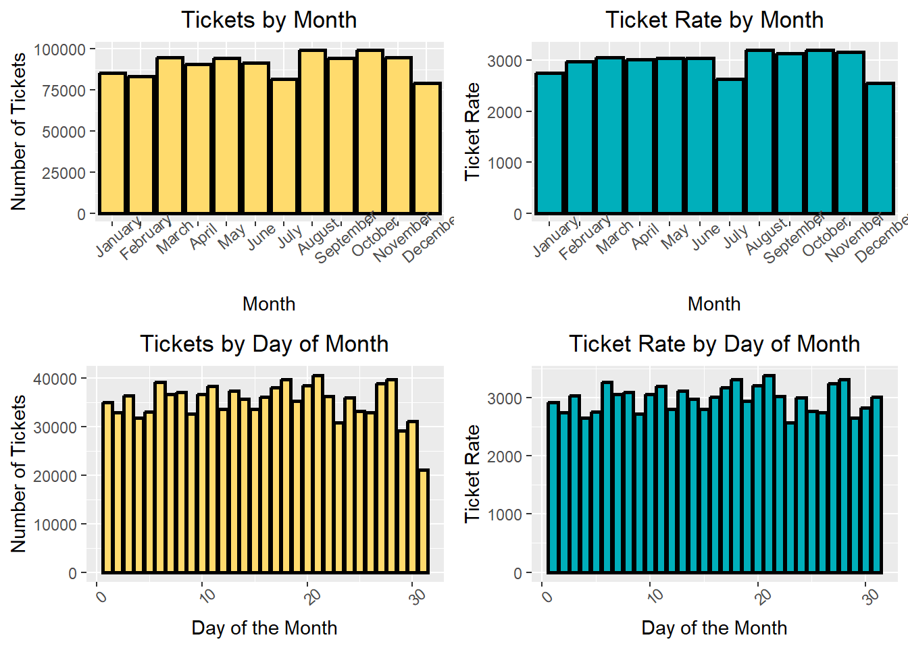
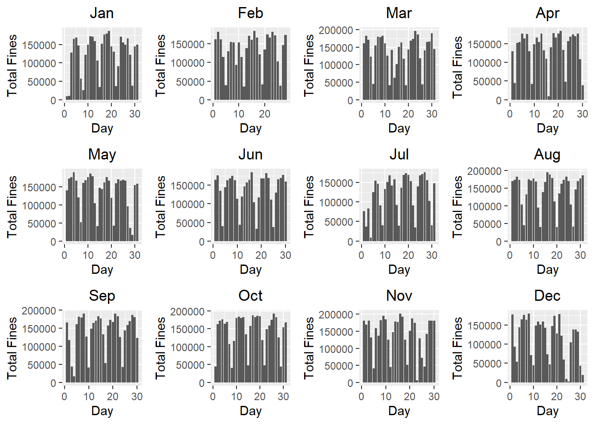
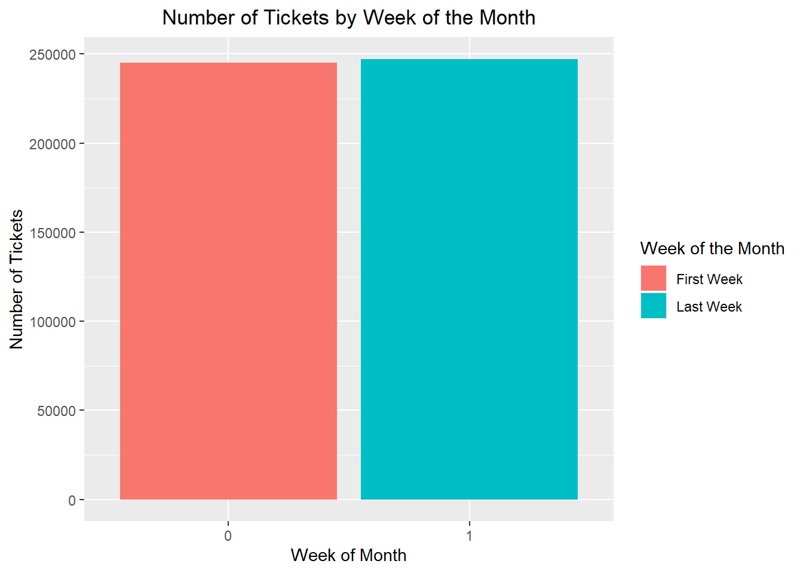
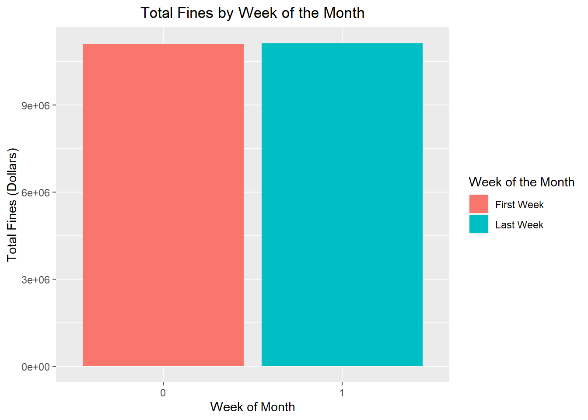

# 2022FinalProj

BST 260 Final Project Repository - Parking Ticket

This site is designed to store and present the project undertaken as a final project for BST260 at the Harvard Chan School of Public Health. 

___________________
**Introduction**:

*Question of Interest*:

Simply put, the goal of this project was to assess the commonly held belief that there more parking tickets given out at specific times as municipalities are motivated to attempt to balance their budget. Answering this questions "perfectly" would require a complicated data collection scheme and therefore, in lieu of that, we will make use of open source data from the city of Philadelphia, Pennsylvania (1,2). 

In addition to the analytical question of interest, this project will utilize data assessment, cleaning, and management skills, data visualization, as well as multiple statistical techniques. 

*Exploratory Data Analysis*
The data is all taken from 2017 and information on more than one million parking tickets that were dispensed across the year. After the data had been inspected for understanding, assessed for completeness, and surveyed for outlier values, we began with visualization. 

In the yellow, we see the number of tickets given out each month above the number of tickets given out each day of the month. Because these values are not standardized for the fact that the months have different lengths, the blue graphs were generated which are adjusted accordingly. Taken together, these demonstrate that there does not appear to be a trend in the number of tickets given out as we near the end of the month or the end of the year. 

Because it is possible that municipalities are trying to balance their buget not by giving out more tickets, but by preferentially seeking out high value parking violations to generate more revenue with the same number of tickets, we explored the data on cost. 

There does appear to be a cyclical trend within weeks (we will not have time to explore this trend), but certainly no increasing trend with more collective fines being dispensed at the end of the month. 

With that preliminary exploratio, we will move onto the results. 

**RESULTS**

In order to maximize the chance of finding a a difference in the ticket or fines being given out based on time of the month, the decision was made to use data from the first and last week of each month. If there is in fact an ulterior motive to giving out parking tickets (i.e. - to balance a budget), one would suspect that the motivation is highest at the end of the month (purportedly when a quota would need to be satisfied) and lowest at the end of the month. Doing this comparison also allows us to take data from an exactly similar size time window from each month (the first 7d and the last 7d), which nicely addresses the differences in the lengths of the months (though it is a little bit of a bear to restructure the data accordingly).

Inspection of the tickets and fines data by week of the month demonstrates near exact parity between the groups visually. 

To go beyond visual inspection, the data were quantified with a t-test. T-test was chosen because the sample size was large enough to ignore concerns regarding non-parametricity (3). The t-test revealed that there was no significnat difference in the number of tickets between the first and last week of the month with a p value of 0.88 and a 95% CI of -385 to 331. With regard to the financial data, again, this difference was not significant with a p value of 0.95 and a 95% confidence interval from $-16298.92 to $15481.90. These statistical tests are consistent with our graphical representations which suggested that we would likely not find a difference in either the number of tickets or the total dollar amount of fines levied.

After the bivariate statistics were performed, we analyzed the data with linear regression in order to be able to account for any potential differences across months. The linear regression for the number of tickets dispensed demonstrated that controlling for the month of the year, switching from the first week of the month to the last week of the month only imparts an expected difference of 27.3 tickets. More importantly, the p-value for this association is not significant at p=0.882. It should be noted that when observing the distribution of the ticket data, it was appreciated that the data were left skewed and therefore, a cubic transformation was perfomed, which did reduce the skewness of the data. However, despite the transformation of the data, the effect of the week of the month was still not signifcant at p=0.879.

Similarly, when evaluating fines based on the week of the month, controlling for the month of the year, we see that there is a difference of 408 dollars. Again, this difference is not statistically significant p=0.96. As with the ticket count data, a cubic transformation was performed on the fine data to address the leftward skew. Despite improvement in the visual distribution of the data, as assessed via histogram, there was no change in the linear regression with no significant effect of the primary predictor with p=0.987.

**Conclusion**

This project explored theh commonly held claim that municipalities dispense more tickets at the end of the month and at the end of the year in order to help balance a budget. The above analyses demonstrated visual representations as well as statistical testing to the contrary. Certainly, this is not entirely generalizeable becuause it is only one year's worth of data from one city, but to the best of our ability, these results demonstrate no temporal variation to parking tickets (other than the visual, cyclic, within-week trend seen in the fines data). Further projects verifying the veracity of these results should expand to include more data from more cities. 

**References**

1) Data source: https://www.opendataphilly.org/dataset/parking-violations

2) Additional sources: https://github.com/rfordatascience/tidytuesday/tree/master/data/2019/2019-12-03

3) Lumley T, Diehr P, Emerson S, Chen L. The importance of the normality assumption in large public health data sets. Annu Rev Public Health. 2002;23:151-69. doi: 10.1146/annurev.publhealth.23.100901.140546. Epub 2001 Oct 25. PMID: 11910059.
